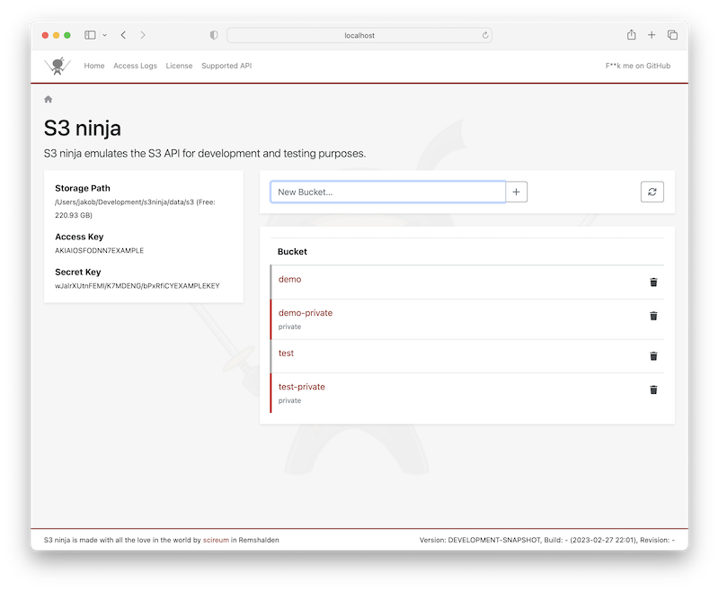

S3 ninja
========

S3 ninja emulates the Amazon S3 API for development and test purposes.



See https://s3ninja.net for more details.

## Development with Docker

### Quick Start with Docker Compose
To run S3 Ninja using Docker Compose for development:

1. Ensure you have Docker and Docker Compose installed.
2. From the project root, run:
   ```
   docker-compose up --build
   ```
   This will build the image and start the service on port 9444, with data persisted in the `./data` directory.

### Manual Docker Commands
- Build the image (requires Maven artifacts in `target/`):
  ```
  docker build -t s3ninja:local .
  ```
- Run the container:
  ```
  docker run --rm -p 9444:9000 -v %cd%/data:/data s3ninja:local
  ```
  - Access the UI at: http://localhost:9444/ui
  - S3 API endpoint: http://localhost:9444/

### Development Workflow
- Mount your local `data/` directory to persist buckets and objects across container restarts.
- For code changes, rebuild the image after running `mvn clean package -DskipTests`.

## Using S3 Presigned POST URLs

S3 Ninja supports AWS S3-compatible presigned POST requests for secure file uploads.

### Generate via UI (docker-friendly)

1. Launch the web UI (default: `http://localhost:9444/ui`) and click **Presigned POST Workbench** or go directly to `http://localhost:9444/.api?presignedPost`.
2. Fill bucket/key/region plus optional session token (generate it inline) and hit **Generate Presigned POST**.
3. Copy the auto-generated HTML form or use the embedded **Test Upload** panel to POST a file against your running instance, no Maven needed.
4. Inspect the policy JSON, Base64 policy, and signature in the results card for debugging or automation.

### Making the Request
- **URL**: `POST http://localhost:9444/<bucket>/<key>`
- **Content-Type**: `multipart/form-data`
- **Form Fields**: Include the generated fields plus the file to upload as `file=@/path/to/file`.

Example `curl` command:
```
curl -X POST "http://localhost:9444/test/example.txt" \
  -F "key=example.txt" \
  -F "policy=<BASE64_POLICY>" \
  -F "x-amz-algorithm=AWS4-HMAC-SHA256" \
  -F "x-amz-credential=<ACCESS_KEY>/<DATE>/<REGION>/s3/aws4_request" \
  -F "x-amz-date=<YYYYMMDDTHHMMSSZ>" \
  -F "x-amz-signature=<HEX_SIGNATURE>" \
  -F "file=@example.txt"
```

If using a session token (from `/session-token` endpoint), add:
```
-F "x-amz-security-token=<SESSION_TOKEN>"
```

The policy enforces conditions like bucket, key, expiration, and optional security token. On success, the file is uploaded; on failure, an XML error is returned.

## Contributions

Contributions as issues or pull requests are always welcome. Please [sign off](https://developercertificate.org) 
all your commits by adding a line like "Signed-off-by: Name <email>" at the end of each commit, indicating that
you wrote the code and have the right to pass it on as an open source

## License

S3 ninja is licensed under the MIT License:

> Permission is hereby granted, free of charge, to any person obtaining a copy
> of this software and associated documentation files (the "Software"), to deal
> in the Software without restriction, including without limitation the rights
> to use, copy, modify, merge, publish, distribute, sublicense, and/or sell
> copies of the Software, and to permit persons to whom the Software is
> furnished to do so, subject to the following conditions:
> 
> The above copyright notice and this permission notice shall be included in
> all copies or substantial portions of the Software.
> 
> THE SOFTWARE IS PROVIDED "AS IS", WITHOUT WARRANTY OF ANY KIND, EXPRESS OR
> IMPLIED, INCLUDING BUT NOT LIMITED TO THE WARRANTIES OF MERCHANTABILITY,
> FITNESS FOR A PARTICULAR PURPOSE AND NONINFRINGEMENT. IN NO EVENT SHALL THE
> AUTHORS OR COPYRIGHT HOLDERS BE LIABLE FOR ANY CLAIM, DAMAGES OR OTHER
> LIABILITY, WHETHER IN AN ACTION OF CONTRACT, TORT OR OTHERWISE, ARISING FROM,
> OUT OF OR IN CONNECTION WITH THE SOFTWARE OR THE USE OR OTHER DEALINGS IN
> THE SOFTWARE.
